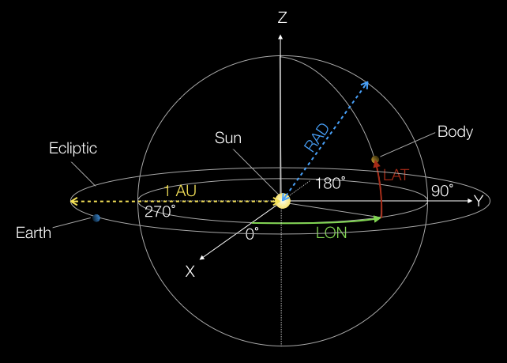

# Aufgabenblatt 3

## Allgemeine Anmerkungen
Ihre Lösung für dieses Aufgabenblatt ist bis Freitag, 17.4. 13h durch `git commit` und `push` 
abzugeben. Mit der Angabe werden folgende Dateien mitgeliefert: `ReadDataUtil.java`, 
`Configuration.csv`, `CelestialSystem.java`, `ComplexCelestialSystem.java` und `In.java`.
Vorgegebene Programmteile dürfen nur an den Stellen verändert werden, die mit TODO markiert sind.
Zusätzliche Klassen, Interfaces, Methoden und Variablen dürfen aber eingefügt werden.
Wenn Sie zusätzlich zu den gefragten Klassen, weitere Klassen definieren, achten Sie darauf, 
dass die Klassennamen mit `My` beginnen, um Konflikte mit späteren Aufgabenblättern zu vermeiden.

## Ziel
Ziel der Aufgabe ist die Implementierung einer rekursiven Datenstruktur (siehe Skriptum Seiten 46-70).

## Beschreibung der gegebenen Dateien
In der Datei `Configuration.csv` sind die Positionen der inneren Planeten unseres Sonnensystems zu 
verschiedenen Zeitpunkten in Polarkoordinaten gespeichert. Die Zeitpunkte sind in Tagen des 
Jahres 2020 angegeben (1 = 1.1.2020, 366 = 31.12.2020). LAT (Latitude) und LON (Longitude) sind in
Winkelgrad angegeben. Der Abstand zur Sonne (RAD) in Astronomischen Einheiten (AU), wobei 1 AU einer
Distanz von 150 Millionen Kilometer entspricht (durchschnittlicher Abstand Sonne zu Erde). Die Sonne
bildet den Ursprung des Koordinatensystems, die Ekliptik (der Erde) bildet die X-Y-Ebene (Z = 0).

Die gegebene Klasse `ReadDataUtil` stellt statische Hilfsmethoden zur Verfügung, um die Positionen 
der spezifizierten Himmelskörper an einem spezifizierten Tag aus der Datei `Configuration.csv` einzulesen 
und daraus ein Objekt der Klasse `CelestialSystem` zu erzeugen. Sie nutzt die Klasse `In`, die
Sie bereits in der LV EP1 benutzt haben (siehe https://introcs.cs.princeton.edu/java/stdlib/javadoc/In.html). 
`CelestialSystem` nutzt eine einfach verkettete Liste um eine unbestimmte Anzahl an 
Himmelskörpern zu speichern. Die Einträge der Liste sind vom Typ `CelestialBody`. Die 
kartesischen Koordinaten von momentaner Position und Bewegungsvektor werden von `ReadDataUtil` aus 
den Polarkoordinaten berechnet (darum brauchen Sie sich nicht zu kümmern). 
`ComplexCelestialSystem` ist eine weitere Klasse, die sie zuletzt implementieren sollen.

## Aufgaben

Ihre Aufgaben sind folgende:

1. In der Klasse `CelestialBody` ist ein zusätzlicher Konstruktor zu implementieren: Dieser 
Konstruktor hat die Parameterliste `CelestialBody body, Vector3 position, Vector3 velocity` und 
initialisiert das Objekt mit allen Werten aus `body` bis auf momentane Position und 
Bewegungsvektor, diese werden durch die Parameter `position` bzw. `velocity` vorgegeben. Weiters
muss `CelestialBody` eine Methode zum Abfragen des Namens des Himmelkörpers anbieten (`getName()
`). Falls weitere Konstruktoren fehlen, ergänzen Sie sie.

2. Sie sollen die Klassendefinition in `CelestialSystem.java` gemäß der Kommentare in der 
Datei vervollständigen. Es dürfen keine vorgefertigten Klassen aus dem Java-Collection-Framework 
benutzt werden. Stattdessen sollen Sie eine verkettete Liste selbst implementieren.

3. Bauen Sie die bereits bestehende Klasse `Simulation` so um, dass anstelle des Arrays ein 
Objekt der Klasse `CelestialSystem` benutzt wird. Das heißt beispielsweise, dass die Zugriffe 
auf die Himmelskörper der Simulation über Methoden von `CelestialSystem` erfolgen müssen.

4. Testen Sie die Simulation mit den Himmelskörpern Sonne, Merkur, Venus, Erde und Mars mit dem 
Startzeitpunkt Tag 60 des Jahres 2020.

5. Bei dieser letzten Teilaufgabe geht es nicht mehr um die Simulation der Planetenbewegungen, das 
heißt, die Positionen und Bewegungen der Himmelskörper sind unwichtig. Das Sonnensystem 
ist ein Beispiel eines Systems, das mehrere Teilsysteme beinhaltet. Ein solches 
Teilsystem ist beispielsweise das System Erde und Erdmond. Ein anderes Teilsystem wäre Jupiter mit 
seinen Monden. Schreiben Sie eine Klasse `ComplexCelestialSystem`, die eine unbestimmte Anzahl 
von `CelestialSystem`-Objekten in einer verketteten Liste speichert. Die Liste bietet Funktionalität
um mit dem Namen nach bestimmten Himmelskörpern zu suchen. Vervollständigen Sie die Definition 
der Klasse `ComplexCelestialSystem` gemäß der Kommentare. Auch hier dürfen keine vorgefertigten 
Klassen aus dem Java-Collection-Framework benutzt werden.
